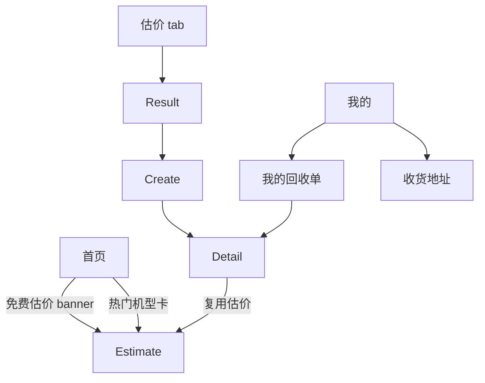

# RePhone 回收端前端设计计划

> **For agentic workers:** REQUIRED SUB-SKILL: Use superpowers:subagent-driven-development (recommended) or superpowers:executing-plans to implement this plan task-by-task. Steps use checkbox (`- [ ]`) syntax for tracking.
> 状态：**待用户验收**。验收通过后按第 7 节任务序执行；执行采用逐任务派发/内联模式，每任务完成输出变更清单与验证方式。

**Goal:** 把回收端小程序从"功能可跑"提升到"设计统一、状态完备、可交付验收"的前端形态，并为出售端复用沉淀设计系统。

**Architecture:** 以 TDesign 1.9.5 组件 + 模板既有自封装组件（`components/*`）为唯一组件来源；新增页面一律复用第 1 节设计令牌；页面内不写魔法色值/字号。回收端五页（estimate/result/create/list/detail）已上线跑通，本计划补齐：设计系统落地、首页业务化、订单详情时间线、空/错/载三态规范化、电商残留入口清理。

**Tech Stack:** 原生小程序 + tdesign-miniprogram@1.9.5 + dayjs；无第三方状态库。

## Global Constraints

- 组件唯一来源：`miniprogram_npm/tdesign-miniprogram/<name>/<name>` 与 `/components/<name>/index`；npm 中**无 load-more**，一律用 `/components/load-more/index`
- 金额展示一律"分→元"经 `common/recycle-status.js:fen2yuan`，禁止页面内裸除 100
- 状态码唯一来源 `common/recycle-status.js`，页面不得写死状态数字
- 主题色系沿用 `style/theme.wxss`（主色 #FF5F15 系），禁止引入新色板
- 不删除 `model/` 与出售端页面（P6 复用），只隐藏入口
- 每任务完成后：编译零报错 + 按验收标准走查 + 输出变更清单

---

## 0. 现状与差距（2026-09-29）

| # | 现状 | 差距 |
|---|---|---|
| 1 | 五个回收页功能可用 | 无统一空态插画/错误重试样式；详情无状态时间线 |
| 2 | 首页仍是电商模板（行李箱 banner + 服饰商品流） | 未业务化：应改为"回收入口 + 热门机型 + 流程说明" |
| 3 | 分类页/购物车页仍为电商残留 | 分类 tab 已移除但页面仍注册；购物车页同；需从 app.json 摘除或改造 |
| 4 | tabBar"估价"用 wr 字体 wallet 图标 | 语义偏差（收款），且非品牌色态 |
| 5 | picker 交互 | 已修复 change→confirm/close bug 与省市区级联（本轮完成） |
| 6 | 表单校验 | create 页手机号/必填已有，缺失焦即时提示与提交禁用态细化 |

## 1. 设计系统（Design Tokens）

新建 `style/design-tokens.wxss`，全部页面 `@import`：

| 令牌 | 值 | 用途 |
|---|---|---|
| `$brand` | #FF5F15 | 主操作/价格/选中态 |
| `$brand-light` | #FFF1E8 | 主色浅底（标签底、选中底） |
| `$success` | #2BA246 | 已打款/已完成 |
| `$warning` | #E37318 | 质检中/待确认 |
| `$info` | #4572FF | 运输中 |
| `$danger` | #FA550F | 已取消/错误重试 |
| `$text-1/2/3` | #333/#666/#999 | 三级文字 |
| `$bg-page` | #F5F5F7 | 页面底 |
| `$radius-card` | 16rpx | 卡片圆角 |
| `$space-page` | 24rpx | 页边距 |

状态色映射（列表标签/详情头/时间线共用，抽成 `common/recycle-status.js` 增加 `statusTheme(status) → 'primary'|'success'|'warning'|'info'|'danger'`）：
10 待寄出=primary · 20 运输中=info · 30 质检中=warning · 40 待确认=warning · 50 已打款=success · 60 已完成=success · 80 已取消=danger

## 2. 信息架构

tabBar：首页 / 估价 / 我的（维持 3 tab）。

## 3. 逐页规格（验收标准见每页末行）

### F-首页（pages/home/home）
- 布局：顶部搜索（保留）→ 主题 banner（"旧机回收 高价秒估"，静态图 + 跳估价）→ 3 宫格流程入口（在线估价/顺丰邮寄/质检打款，各配 wr 图标）→ 热门机型横滑列表（取 estimate 种子前 8 机型，点击带 brandId 跳估价）→ 底部"回收流程 4 步"说明卡
- 数据：`fetchHome` 改造（mock 分支返回上述结构，真实分支预留 `/api/wx/home`）；商品流 goods-list 移除
- 验收：页面无任何服饰/电商内容；4 个入口跳转正确

### F-估价页（pages/recycle/estimate）
- 顶部加 `t-steps`（选机型 → 描述成色 → 获取报价，3 步指示，随表单完成度推进）
- 品牌/机型/内存三项改为必选卡（已选打勾态）；成色 radio 保留；问题 checkbox 保留
- 验收：三步指示随选择推进；重复确认同值不再出现弹层卡死（本轮已修）

### F-结果页（pages/recycle/result）
- 价格卡加"高于/低于市场价"提示位（P6 接行情后启用，占位隐藏）；"立即下单"主按钮 + "重新估价"次按钮布局已定
- 验收：fen2yuan 展示；下单跳 create

### F-下单页（pages/recycle/create）
- 取件方式双卡（邮寄/上门，图标 + 说明，选中描边）替代 radio 列表
- 表单：失焦校验手机号（正则 `^1\d{10}$`）实时红字；提交按钮 loading/禁用已有
- 省市区 picker 级联（本轮已修：confirm/close 事件 + 列初始化 + 双列联动 + 完整性校验）
- 验收：空值/半选/错手机号三种拦截路径全部生效

### F-订单列表（pages/recycle/order/list）
- 订单卡按状态显示主题色标签（第 1 节映射）；`t-load-more` 三态 + list-is-empty（本轮已修）
- 空态：t-empty（description="暂无回收单，估价立得高额回收价"）+ 去估价按钮（已有）
- 验收：下拉刷新/触底加载/失败点击重试三路径可用

### F-订单详情（pages/recycle/order/detail）
- 新增状态时间线 `t-steps`（垂直，7 节点取 `STATUS_DESC`，当前步 theme 高亮，只展示已到达节点+下一步）
- 状态标签用主题色；操作按钮维持：10→[填运单号/取消]、40→[确认打款]；50/60/80 无操作
- 验收：各状态截图走查；时间线节点与 status 一致

### F-我的（pages/usercenter）
- "我的回收单"入口置顶（已做）；头像区改"机友 + 手机号尾号"占位文案
- 验收：入口顺序 回收单→地址；无优惠券/积分残留

### F-入口清理
- `app.json` 移除 `pages/cart/index`、`pages/category/index` 注册（页面文件保留供 P6）；`goods/details` 加购按钮临时隐藏（buy-bar 只留立即购买）
- 验收：全站无购物车/分类可达入口；编译无"页面被注册但无入口"警告

## 4. 组件清单

| 组件 | 来源 | 用于 |
|---|---|---|
| t-cell(-group)/t-button/t-input/t-textarea/t-picker(-item)/t-radio(-group)/t-checkbox(-group)/t-tag/t-steps/t-empty/t-popup/t-icon | TDesign npm | 全部回收页 |
| load-more（t-load-more） | `/components/load-more/index` | 列表页 |
| webp-image（t-image） | `/components/webp-image/index` | 首页 banner/机型图 |
| price（wr-price） | `/components/price/index` | 金额展示统一替换裸文本（result/detail/list） |

**新建组件（本计划新增）：**
- `components/status-tag/index`：props `status`，内部查 STATUS_DESC+statusTheme 输出 t-tag——列表/详情共用，消灭两处重复映射
- `components/section-card/index`：统一卡片容器（白底/圆角/标题/内边距），替换各页手写 .section-title+.form-card

## 5. 交互与状态矩阵（每个数据页必须实现）

| 状态 | 表现 |
|---|---|
| Loading | 页级：t-loading 居中；区块：骨架或按钮 loading |
| Empty | t-empty + 主操作按钮（去估价/去下单） |
| Error | 可重试区（错误文案 + 重试按钮）；toast 仅用于动作失败 |
| Submitting | 按钮 loading + 防重（submitting 标志，已有） |

网络层兜底：`services/request.js` 已统一 401 重登与错误抛出，页面不得再自行解析 statusCode。

## 6. 实施任务拆分（顺序执行，每任务独立验收）

- [ ] **F1 设计系统落地**：新建 `style/design-tokens.wxss` + `common/recycle-status.js` 增加 `statusTheme()`；五回收页 + usercenter import 并替换手写色值。验收：grep 页面 wxss 无 #FF5F15 等裸色值（tokens 文件除外）。commit: `feat(f1): design tokens and status theme mapping`
- [ ] **F2 抽公共组件**：`components/status-tag`、`components/section-card`；列表/详情/结果页替换。验收：两处以上重复的标签/卡片样式全部走组件。commit: `feat(f2): status-tag and section-card shared components`
- [ ] **F3 首页业务化**：`services/home/home.js` mock 结构改造 + `pages/home/home.*` 重写（规格见 F-首页）。验收：F-首页验收行。commit: `feat(f3): recycle-oriented home page`
- [ ] **F4 详情时间线**：detail 页加 t-steps 垂直时间线 + status-tag 替换。验收：F-订单详情验收行。commit: `feat(f4): order status timeline`
- [ ] **F5 入口清理**：app.json 摘除 cart/category；buy-bar 隐藏加购；goods/details 跳购物车入口摘除。验收：F-入口清理验收行 + 全站 grep 无 switchTab cart。commit: `feat(f5): remove retail entries`
- [ ] **F6 表单体验**：create 页失焦校验、取件方式卡片化、estimate 步骤指示。验收：F-下单页/F-估价页验收行。commit: `feat(f6): form polish and step indicator`

每个任务：完成后跑「编译零报错 + 对应验收行人工走查」，由控制者输出变更清单；全部完成后做一次整分支 review（superpowers:requesting-code-review）再提交用户终验。

## 7. 用户验收清单（按序走查）

1. 清缓存编译 → 五页（估价/结果/下单/列表/详情）无白屏、无组件缺失报错
2. 估价→下单→详情全流程，picker 三处交互无卡死（重复选同值可正常关闭）
3. 列表页：下拉刷新、触底加载、筛选切换、空态文案
4. 详情页：填运单号弹窗、取消订单、确认打款按钮按状态出现
5. 个人中心：回收单入口、地址入口，无电商菜单
6. 首页（F3 后）：无电商内容，四个入口跳转正确
7. 控制台无红色报错（工具自身 preload 警告除外）
